```mermaid
flowchart LR
  U[User / Client]

  subgraph Edge[Edge]
    APIGW[API Gateway<br>Custom Domain<br>https://taxdown.alejandrogalaz.site]
  end

  subgraph LambdaFn[Lambda]
    HANDLER[src/index.handler]
    CTRL[CustomerController<br>infrastructure/http]
  end

  subgraph App[Application Layer]
    UC[Use Cases<br>Create / Get / Update / Delete / AddCredit / List]
  end

  subgraph Domain[Domain Layer]
    ENT[Entities + Domain Errors]
    PORT[CustomerRepository Port]
  end

  subgraph Infra[Infrastructure Layer]
    ADAPT[DynamoCustomerRepository Adapter]
  end

  subgraph Data[Data Store]
    DDB["DynamoDB Table<br>taxdown-customers-prod"]
  end

  %% Main flow
  U -->|HTTP JSON| APIGW -->|Invoke| HANDLER --> CTRL --> UC --> PORT
  PORT -->|Impl| ADAPT -->|Get / Put / Update / Scan| DDB
  ADAPT --> PORT --> UC --> CTRL -->|HttpResponse| HANDLER --> APIGW -->|HTTP Response| U

  %% Local development path (dashed)
  classDef dashed stroke-dasharray: 5 5
  OFFLINE[serverless-offline]:::dashed
  DDBLocal["DynamoDB Local"]:::dashed
  APIGW -. use -.-> OFFLINE
  DDB -. alt -.-> DDBLocal

```

# TaxDown Customer API 🏍️💳

A Serverless REST API built with TypeScript that manages Customers for an online motorbike shop. It supports full CRUD, adding available credit, and listing customers sorted by available credit. Designed with SOLID principles, Domain-Driven Design (DDD), and Hexagonal Architecture for clean, testable code.

<!-- markdownlint-disable MD033 -->
<div align="center">
  
  <br />
  <em>TaxDown Customer API — demo</em>
</div>
  <br />
<p align="center">
  <a href="https://alejandrogalaz21.github.io/serverless-api/" target="_blank" rel="noreferrer">
    
  </a>
  
</p>
<!-- markdownlint-enable MD033 -->

- Runtime: AWS Lambda (Node.js 20) + API Gateway
- Storage: DynamoDB (Local via Docker for development, AWS in production)
- Build: TypeScript
- Local Dev: serverless-offline + DynamoDB Local (Docker)

---

## 🛠️ Tech Stack

[](https://nodejs.org/)
[](https://www.typescriptlang.org/)
[](https://www.serverless.com/)
[](https://aws.amazon.com/lambda/)

[](https://aws.amazon.com/)
[](https://aws.amazon.com/dynamodb/)
[](https://jestjs.io/)
[](https://www.docker.com/)

---

## ✅ Requirements

- Node.js 18+ (tested with v20)
- npm 8+
- Docker Desktop (for DynamoDB Local and Admin UI)
- Serverless Framework v4 (global or npx)
- AWS credentials (only required for deploy)

Optional environment variables:

- `CUSTOMER_TABLE` — defaults to `taxdown-customer-api-customers-dev` (see `serverless.yml`)
- `DYNAMODB_ENDPOINT` — override DynamoDB endpoint (defaults to `<http://localhost:8000>` when offline)

---

## 🧭 Architecture (SOLID • DDD • Hexagonal)

This project embraces Hexagonal Architecture (Ports & Adapters) to keep business logic independent of frameworks or databases.

- Domain (Core): entities, errors, and business rules — no external deps
- Application (Use Cases): orchestrate domain logic, express intents
- Infrastructure (Adapters): repositories (DynamoDB), controllers (API Gateway), config

Guiding principles:

- SOLID: SRP, OCP, LSP, ISP, DIP
- DDD: Ubiquitous language (Customer, available credit), clear boundaries
- Hexagonal: Ports (interfaces) and Adapters (implementations)

### End-to-end flow (API Gateway ➜ Lambda ➜ Layers)



Notes:

- Presentation: API Gateway + Lambda handler call the controller, which maps HTTP to use-cases and handles errors.
- Application: Use-cases orchestrate domain behavior without knowing persistence details.
- Domain: Entities, value objects, and domain errors; the `CustomerRepository` is a port.
- Infrastructure: `DynamoCustomerRepository` implements the port and talks to DynamoDB.
- Local development: Serverless Offline emulates API Gateway + Lambda; DynamoDB Local replaces the AWS service.

---

## 📁 Project Structure

```text
./
├─ src/
│  ├─ domain/                      # Core business layer
│  │  ├─ Customer.ts               # Customer entity with behavior (update, addCredit)
│  │  ├─ CustomerRepository.ts     # Port: ICustomerRepository
│  │  └─ errors/DomainError.ts     # DomainError, NotFoundError, ValidationError
│  ├─ application/
│  │  └─ use-cases/                # Application services (intents)
│  │     ├─ CreateCustomer.ts
│  │     ├─ GetCustomer.ts
│  │     ├─ UpdateCustomer.ts
│  │     ├─ DeleteCustomer.ts
│  │     ├─ AddCredit.ts
│  │     └─ ListCustomers.ts
│  ├─ infrastructure/
│  │  ├─ config/dynamoClient.ts    # Dynamo clients + ensureTableExists (local only)
│  │  ├─ repositories/
│  │  │  ├─ DynamoCustomerRepository.ts  # Adapter: DynamoDB implementation
│  │  │  └─ InMemoryCustomerRepository.ts# Adapter: for tests
│  │  └─ http/
│  │     ├─ HttpResponse.ts        # JSON/204 helpers
│  │     └─ CustomerController.ts  # Maps HTTP -> use-cases, error handling
│  └─ index.ts                     # Lambda handler wiring (DI)
├─ tests/
│  └─ create-and-credit.test.ts    # Sample use-case test with in-memory repo
├─ docker-compose.yml              # DynamoDB Local + Admin UI
├─ serverless.yml                  # Functions, IAM, resources (DynamoDB table)
├─ tsconfig.json                   # TS config
├─ webpack.config.js               # Webpack bundling
├─ jest.config.js                  # Jest with ts-jest
└─ package.json                    # Scripts and deps
```

> All code uses JSDoc-style comments.

---

## 🚀 Running Locally

1. Start DynamoDB Local + Admin UI (Docker):

   ```bash
   docker compose up -d
   ```

   - DynamoDB Local: <http://localhost:8000>
   - Admin UI: <http://localhost:8001>

1. Install dependencies:

   ```bash
   npm install
   ```

1. Start the API with Serverless Offline:

   ```bash
   npm run start
   ```

   Notes:
   - When running offline, the app connects to `<http://localhost:8000>` automatically (`IS_OFFLINE=true`).
   - The API auto-creates the local table on first request if missing (no need to pre-provision locally).

1. Run tests (optional):

   ```bash
   npm test
   ```

---

## 🌐 Base URLs

- Production (custom domain): `https://taxdown.alejandrogalaz.site/api/v1`
- Local (offline): `http://localhost:3000/dev/api/v1`

Notes:

- The custom domain maps directly to the stage, so no `/prod` path is needed. Routes are served from the root, e.g. `/api/v1/customers`.
- For local development, the stage prefix `/dev` is included by Serverless Offline.

---

## 📚 API Reference & Examples

Entity shape (Customer):

```json
{
  "id": "uuid",
  "name": "string",
  "email": "string",
  "phone": "string | null",
  "availableCredit": 0,
  "createdAt": "ISO-8601",
  "updatedAt": "ISO-8601"
}
```

### 1) Create customer

- POST `/customers`
- Body:

```json
{ "name": "Jane Rider", "email": "jane@example.com", "phone": "+34 600 000 000" }
```

Example (local):

```bash
curl -s -X POST http://localhost:3000/dev/api/v1/customers \
  -H "Content-Type: application/json" \
  -d '{"name":"Jane Rider","email":"jane@example.com"}' | jq
```

Example (production):

```bash
curl -s -X POST https://taxdown.alejandrogalaz.site/api/v1/customers \
  -H "Content-Type: application/json" \
  -d '{"name":"Jane Rider","email":"jane@example.com"}' | jq
```

### 2) Get customer by id

- GET `/customers/{id}`

```bash
# Local
curl -s http://localhost:3000/dev/api/v1/customers/<id> | jq

# Production
curl -s https://taxdown.alejandrogalaz.site/api/v1/customers/<id> | jq
```

### 3) Update customer

- PUT `/customers/{id}`
- Body (partial):

```json
{ "name": "Jane R.", "email": "jane.r@example.com", "phone": "+44 7700 900123" }
```

Example:

```bash
# Local
curl -s -X PUT http://localhost:3000/dev/api/v1/customers/<id> \
  -H "Content-Type: application/json" \
  -d '{"name":"Jane R."}' | jq

# Production
curl -s -X PUT https://taxdown.alejandrogalaz.site/api/v1/customers/<id> \
  -H "Content-Type: application/json" \
  -d '{"name":"Jane R."}' | jq
```

### 4) Delete customer

- DELETE `/customers/{id}`

```bash
# Local
curl -i -X DELETE http://localhost:3000/dev/api/v1/customers/<id>

# Production
curl -i -X DELETE https://taxdown.alejandrogalaz.site/api/v1/customers/<id>
```

### 5) Add available credit

- POST `/customers/{id}/add-credit`
- Body:

```json
{ "amount": 200 }
```

Example:

```bash
# Local
curl -s -X POST http://localhost:3000/dev/api/v1/customers/<id>/add-credit \
  -H "Content-Type: application/json" \
  -d '{"amount":200}' | jq

# Production
curl -s -X POST https://taxdown.alejandrogalaz.site/api/v1/customers/<id>/add-credit \
  -H "Content-Type: application/json" \
  -d '{"amount":200}' | jq
```

### 6) List customers (optionally sorted by credit)

- GET `/customers`
- Query: `?sortByCredit=true` to sort by `availableCredit` desc

```bash
# Local
curl -s "http://localhost:3000/dev/api/v1/customers?sortByCredit=true" | jq

# Production
curl -s "https://taxdown.alejandrogalaz.site/api/v1/customers?sortByCredit=true" | jq
```

---

## 📖 Live API Docs (GitHub Pages)

- URL: <https://alejandrogalaz21.github.io/serverless-api/> 🔗
- What it is: A static Swagger UI that loads the OpenAPI spec from this repo and lets you try endpoints directly in the browser.
- How to use:
  1) Open the URL above.
  1) Use the Servers dropdown in the top-right:
  - Production: <https://taxdown.alejandrogalaz.site> ☁️
  - Local: <http://localhost:3000/dev> (run `npm run start`) 🖥️
  - AWS API ID: <https://YOUR_API_ID.execute-api.us-west-2.amazonaws.com/{stage}>
  1) Click “Try it out”, fill the payload, then “Execute” ▶️
- Notes:
  - CORS is enabled in `serverless.yml` for all routes ✅
  - GitHub Pages is static and only forwards requests from your browser to your API; no secrets are stored there 🔒

---

## 🧩 Design Details

- Validation: basic checks for required fields and email format; credit amount must be positive
- Sorting: performed in application layer after `Scan` — for large datasets, consider a GSI on `availableCredit`
- Error handling: domain errors mapped to HTTP status codes
  - 400 ValidationError
  - 404 NotFoundError
  - 422 DomainError (generic domain issues)
  - 500 Unhandled/unknown
- Dependency Injection: handler wires repository and use-cases; easy to swap implementations
- JSDoc: used across domain/use-cases for maintainability and better IDE help

---

## 🔧 Configuration

- `serverless.yml`
  - Function: `api` -> `src/index.handler`
  - Environment: `CUSTOMER_TABLE = ${service}-customers-${stage}`
  - IAM: minimal DynamoDB access (Get/Put/Update/Delete/Scan) for the table
  - Resources: DynamoDB table (provisioned by CloudFormation in AWS)
  - Plugins: `serverless-webpack`, `serverless-offline`

- `tsconfig.json`: ES2020, strict mode, commonjs modules

---

## 🧪 Testing

- Unit tests with Jest + ts-jest
- In-memory repository to avoid AWS dependencies in tests

```bash
npm test
```

---

## 📦 Deployment (optional)

Requires AWS credentials configured (e.g., via `aws configure`).

```bash
npm run deploy:dev
npm run info
```

This deploys the stack (Lambda, API Gateway, DynamoDB table) to the configured AWS account/region.

---

## 👤 Author & Notes

- Author: Alejandro Galaz
- Built for an evaluation focusing on SOLID, API Design, DDD, and Hexagonal Architecture
- Feedback and improvements are welcome

---

### Contact

[](https://alejandrogalaz.site/)
[](https://www.linkedin.com/in/alejandrogalaz/)
[](https://alejandrogalaz21.github.io/serverless-api/)
[](mailto:alejandrogalaz21@gmail.com)


